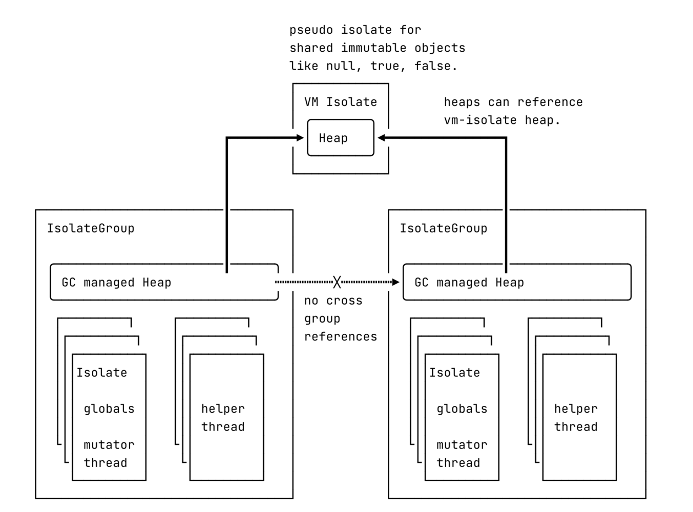
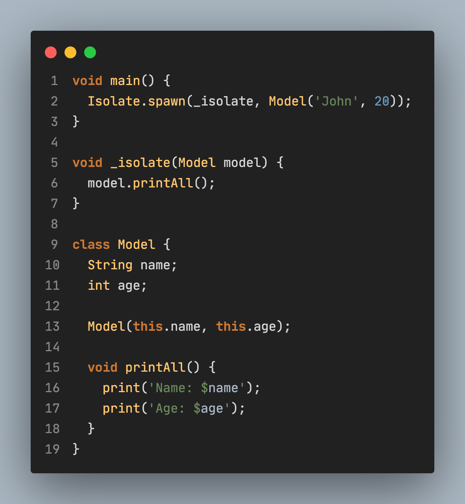

## Introduction

A while back, I encountered the term __"isolate groups"__ and found myself unsure of its meaning. However, upon delving into the subject and perusing relevant resources on GitHub, I came to appreciate just how valuable and practical it can be for the entire Dart community. Several months later, I decided to write a brief article on the topic, which I hope will help others understand the concept and its benefits.

## What is the Isolate?

__Dart__ is a programming language that is designed to follow a __single-threaded paradigm__, meaning that explicit thread operations are not allowed. This approach helps to prevent common concurrency issues like race conditions, deadlocks, and starvation, among others. In turn, Dart also offers a powerful mechanism called isolates that enables parallel execution by allowing multiple isolates to run concurrently. Each isolate operates independently with its own memory space and message queue, providing a simpler and more robust way to handle concurrency in Dart.

## New feature: Isolate Groups

Lightweight isolates and isolate groups were released in Dart a while back and they have been a huge success. They enhanced the performance of Dart Isolates by more than 10 times without the need for any migrations!

### So, what do those Groups do?

>Isolates are grouped together into isolate groups. Isolate within the group share the same garbage collector managed heap, used as a storage for objects allocated by an isolate. Heap sharing between isolates in the same group is an implementation detail which is not observable from the Dart code. Even isolates within the same group can not share any mutable state directly and can only communicate by message passing through ports (not to be confused with network ports!).
Generally, this means that if your Isolates are in the same group, you can send not only the plain objects between, such behaviour was not possible before.

## How to create an isolate?

- __Isolate.spawn__ - Creates and spawns an isolate that shares the same code as the current isolate.

- __Isolate.spawnUri__ - Quite advanced method. It creates a new isolate in *new isolate group* from the URI you passed in. This URI must point to a dart file or AOT snapshot which contains main function.

- __Isolate.run__ - Simply run a function in another isolate and return the result.
